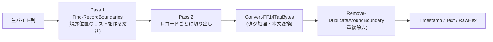
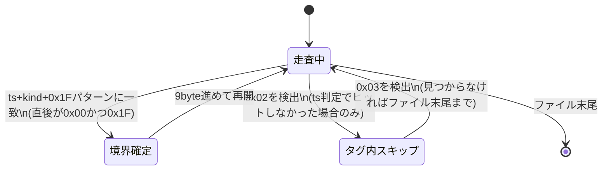
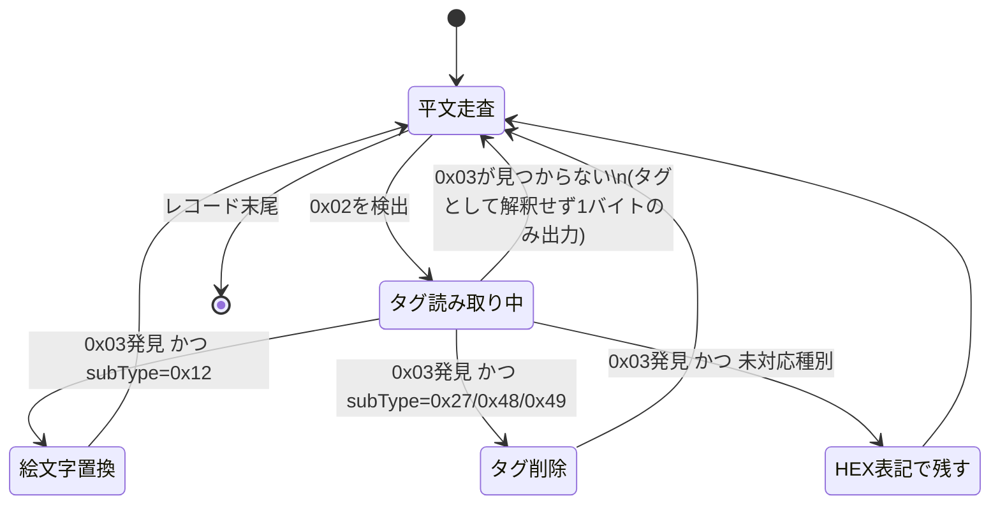
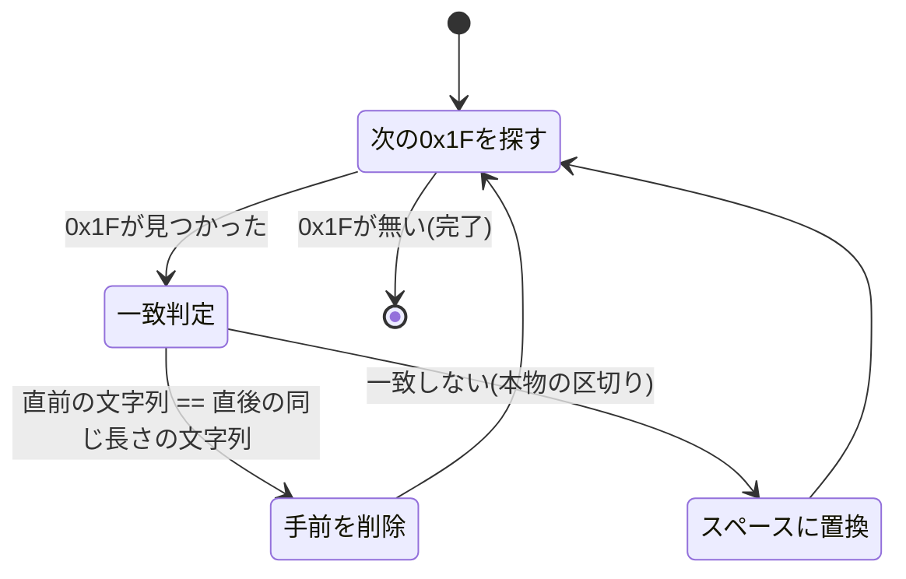

# FF14LogDecoder 仕様書

## 1. 概要

FFXIV(Final Fantasy XIV)のバイナリチャットログ(`0000000X.log`形式)を解析し、
タイムスタンプと本文だけを人が読める形に復元するPowerShellモジュール。

対象ファイルは、ゲーム内メモリのチャットバッファをそのままダンプしたもので、
UTF-8のテキストと、SeString形式の制御タグ(カラーコード・アイテムリンク・
プレイヤー名リンク等)が無秩序に混在している。加えて、元データの時点で
一部のバイトが既にUTF-8として復元不能(`U+FFFD`)になっている箇所がある。

## 2. データ構造

### 2.1 レコードヘッダー

各レコードは次の固定ヘッダーで始まる。

| オフセット | 長さ | 内容 |
|---|---|---|
| +0 | 4 byte | Unixタイムスタンプ(リトルエンディアン) |
| +4 | 4 byte | 種別(リトルエンディアン整数)。通常のチャットは値が小さく上位バイトが0になりやすいが、システム告知など値が大きい種別も存在する(例: ダイスロール通知 = `0x0000204A`) |
| +8 | 1 byte以上 | カラーコード(`0x1F`の連続。1個の場合と2個の場合がある) |

ヘッダーの直後から、次のレコードのヘッダーが始まる直前までが本文。

### 2.2 本文中のタグ

本文中には `0x02 <種別> ... 0x03` という制御タグが埋め込まれる。判明している種別:

| 種別(タグ先頭2バイト目以降で判別) | 意味 | 変換 |
|---|---|---|
| `02 27 ...` (名前リンク/DCアイコン等、複数バリエーションあり) | プレイヤー名・ワールドアイコンへのリンク | タグ自体を削除(直後に同じ内容がプレーンテキストで続くため) |
| `02 12 ?? ?? 4A 03` | ダイスの目アイコン | 🎲 に変換 |
| `02 12 ?? ?? 59 03` | DC/ワールド接続アイコン(花) | 🌸 に変換 |
| `02 48 ...` / `02 49 ...` | (詳細未確定、名前リンクと同系統) | タグ自体を削除 |
| 上記以外 | 未対応 | `[XX XX XX ...]` の16進表記で残す(情報を失わないため) |

名前リンクタグは、直後に同じ名前がプレーンテキストとしてもう一度書かれる、という
構造になっている。自分自身のキャラクター名は名前リンクタグで包まれず、
最初から「名前 + `0x1F` + 同じ名前」という形でプレーンテキストのまま2回書かれる。
また、1つのメッセージ内で名前リンク一式(タグ+プレーン名)が理由不明のまま
2セット連続で埋め込まれるケースもある。これらはいずれも、変換後テキスト中に
`0x1F`で区切られた重複として現れる(詳細は4.3節)。

### 2.3 既知の制限

- 元データの時点で既に破損しているバイト(`U+FFFD`)がある。値は復元不能。
- タイムスタンプ判定はヒューリスティック(妥当な範囲の値 + 直後が`0x00`+`0x1F`)であり、
  理論上は本文中の固定文字列が偶然一致する可能性がゼロではない
  (ランダムなバイト列がこの条件に一致する確率はおよそ150万分の1、
  ファイル全体での期待発生数は1件未満)。同じ固定文字列(自キャラ名など)が
  該当する場合は毎回再現するため、実際に発生した際は個別に対処する。
- 未対応のタグ種別は`[...]`のHEX表記のまま残る。

## 3. 処理の全体像(2パス構成)

本文の変換とレコード境界の検出を完全に分離しているのが設計上のポイント。
これにより、タグの有無に関わらず「レコードの範囲」が変換処理より先に確定するため、
タグを持たないプレーンテキストのレコードが次のレコードのヘッダーに
食い込むという問題が構造的に起きなくなる。

## 4. 状態遷移

### 4.1 Pass 1: Find-RecordBoundaries

判定順序が重要: **タイムスタンプの判定を`0x02`タグ判定より先に行う**。
タイムスタンプの先頭バイトが偶然`0x02`になることがあり、順序を逆にすると
本物のレコード境界をタグの中身だと誤解して丸ごと読み飛ばしてしまう。

### 4.2 Pass 2: Convert-FF14TagBytes(1レコード分の本文変換)

### 4.3 Remove-DuplicateAroundBoundary(重複除去)

Convert-FF14TagBytesの出力(この時点では`0x1F`がまだ残っている)に対して適用する。

本物の`0x1F`だけを目印にすることで、`"Non Nonon"`のような自然な半角スペースを
含む名前を、誤って重複と判定することがない(スペース文字列ベースの一致判定だと
"Non"が"Nonon"の先頭と偶然一致してしまう誤検出が起きるため、これを避けるために
`0x1F`という実データ上の目印だけを基準にしている)。

## 5. 関数リファレンス

| 関数 | 役割 |
|---|---|
| `Convert-FF14LogRecords($rawBytes)` | 公開エントリポイント。`Timestamp`/`Text`/`RawHex`を持つオブジェクトのリストを返す |
| `Find-RecordBoundaries($rawBytes)` | Pass 1。レコード先頭位置(int)のリストを返す |
| `Find-EtxTerminal($rawBytes, $currentIndex, $len)` | 指定位置から`0x03`を探索し、その位置を返す |
| `Convert-FF14TagBytes($rawBytes)` | Pass 2。1レコード分のタグ処理を行い、文字列を返す |
| `IconConversion($rawBytes, $ms, $start, $len)` | `0x12`タグをダイス/花アイコンに変換できたかを`$true`/`$false`で返す |
| `Remove-DuplicateAroundBoundary($text)` | `0x1F`を目印に前後の重複を除去する |
| `Write-Utf8String($ms, $text)` | 文字列をUTF-8バイト列としてMemoryStreamに書き込む |

## 6. 出力形式

`Convert-FF14LogRecords`は以下のプロパティを持つオブジェクトのリストを返す。

| プロパティ | 型 | 内容 |
|---|---|---|
| `Timestamp` | DateTimeOffset(ローカル時刻) | レコードのタイムスタンプ |
| `Text` | string | 変換済みの本文 |
| `RawHex` | string | レコード全体(ヘッダー含む)の元バイト列を16進文字列化したもの。診断用 |

## 7. 今後の課題

- 未対応タグ種別の解明(`[...]`のHEX表記で残っているもの)
- `type`(種別)値ごとの意味の特定(システム/チャット/エモート等の分類)
